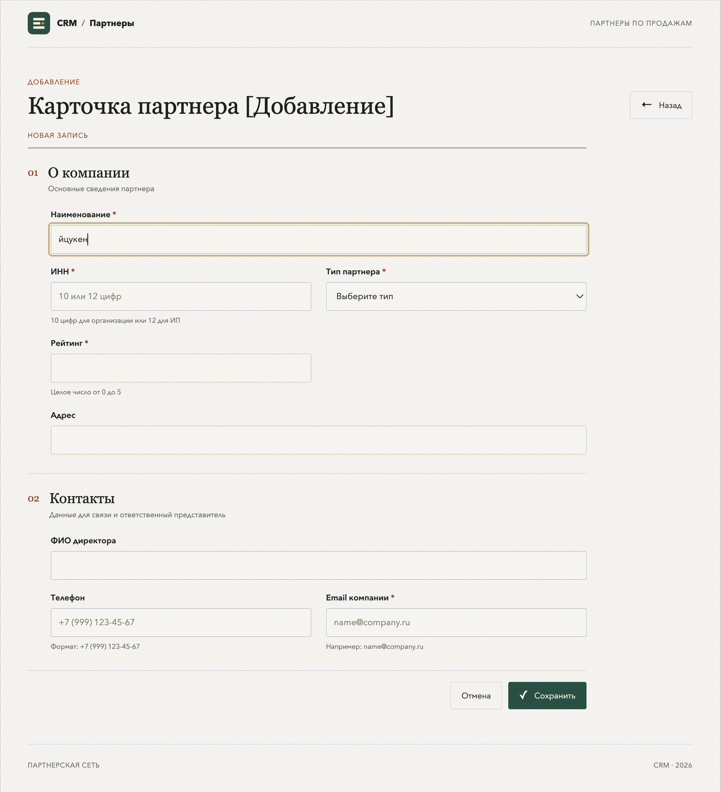

# Обработка исключений и интерактивные уведомления (UX/UI)

## Реализовано

- Диалог `Error` для некорректного ввода, ошибок загрузки и проблем сохранения. Текст объясняет причину и предлагает следующие действия.
- Диалог `Warning` перед уходом с измененной карточки. Кнопки позволяют остаться или явно отказаться от несохраненных изменений.
- Диалог `Information` после успешного сохранения и обновления списка.
- У всех диалогов разные заголовки и пиктограммы; окно доступно с клавиатуры и удерживает фокус.
- При попытке закрыть/перезагрузить страницу браузер показывает штатное предупреждение о несохраненных данных.
- Ошибки SQL/API журналируются сервером с временем; SQL-запросы переиспользуются из CRUD-этапа и остаются параметризованными.

## Запуск

Настройте PostgreSQL и миграцию полей партнера, как описано в README задания «Интеграция формы с БД». Создайте `.env` по примеру `.env.example`, установите зависимости и запустите сервер:

```bash
python3 -m pip install -r requirements.txt
python3 server.py
```

Для уже настроенного окружения практики можно запускать через Python из `.venv` предыдущего backend-задания. Откройте `http://127.0.0.1:8006/index.html`.

Сервер этой папки отдает текущие страницы и делегирует API CRUD-серверу предыдущего задания. Порт по умолчанию — `8006`.

## Проверка сценариев

1. На карточке оставьте пустым название или введите неправильный email/ИНН/рейтинг и нажмите «Сохранить»: появится Error с подсказкой.
2. Измените любое поле и нажмите «Назад» или «Отмена»: Warning предложит остаться либо покинуть карточку.
3. Сохраните валидную карточку при доступной БД: после записи откроется реестр и Information подтвердит результат.
4. Остановите PostgreSQL/API перед загрузкой или сохранением: пользователь получит Error с рекомендацией проверить подключение и повторить попытку.

## Демонстрация



Предупреждение при закрытии вкладки использует системный диалог браузера: браузеры не разрешают веб-страницам задавать собственный текст или пиктограмму для `beforeunload`.
