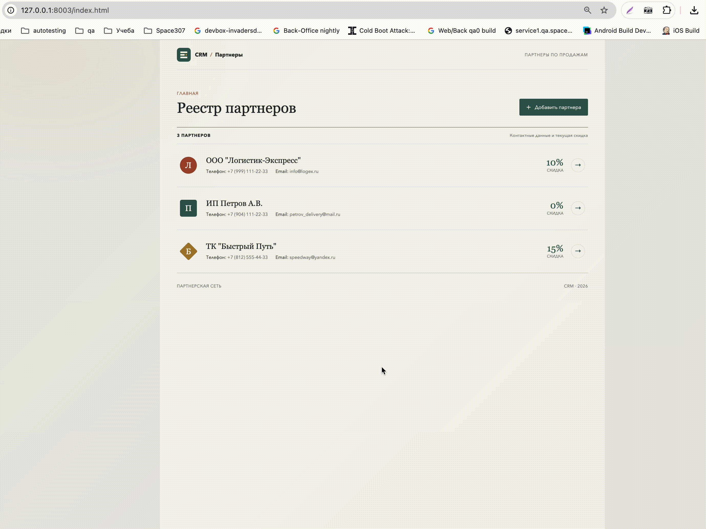

# Проектирование многооконной архитектуры и навигации

## Цель этапа

Создать переход между реестром партнеров (`MainWindow`) и карточкой партнера (`PartnerEditWindow`) без уничтожения главного экрана и его состояния.

## Что реализовано

- Главный экран с реестром партнеров и кнопкой «Добавить партнера».
- Переход в карточку как в режиме добавления, так и по кнопке конкретного партнера.
- Уникальные заголовки главного экрана и карточки; для карточки отражается режим работы.
- Возврат кнопкой «Назад» и штатная навигация браузера.
- Идентификатор выбранного партнера передается в экран карточки.
- Экран реестра остается смонтированным во время перехода, поэтому список не теряет состояние.

Реализованы отдельные страницы `index.html` и `partner-edit.html`. Режим и `partner_id` передаются через URL, а прокрутка реестра сохраняется при переходе в карточку и возвращается при навигации назад.

## Запуск

Из этой папки выполните:

```bash
python3 -m http.server 8003
```

Откройте `http://127.0.0.1:8003/index.html`.

На этом этапе список использует демо-набор в `partners-data.js`. Поля формы, запись в БД, обновление списка после сохранения и диалоги ошибок относятся к следующим заданиям практики.

## Демонстрация



## Последовательность практики 21.09.2026

1. Проектирование многооконной архитектуры и навигации — текущий этап.
2. Разработка формы добавления/редактирования партнера — поля и ввод.
3. Интеграция формы с БД — загрузка, INSERT/UPDATE и обновление реестра.
4. Обработка исключений и интерактивные уведомления — ошибки и UX-сценарии.
