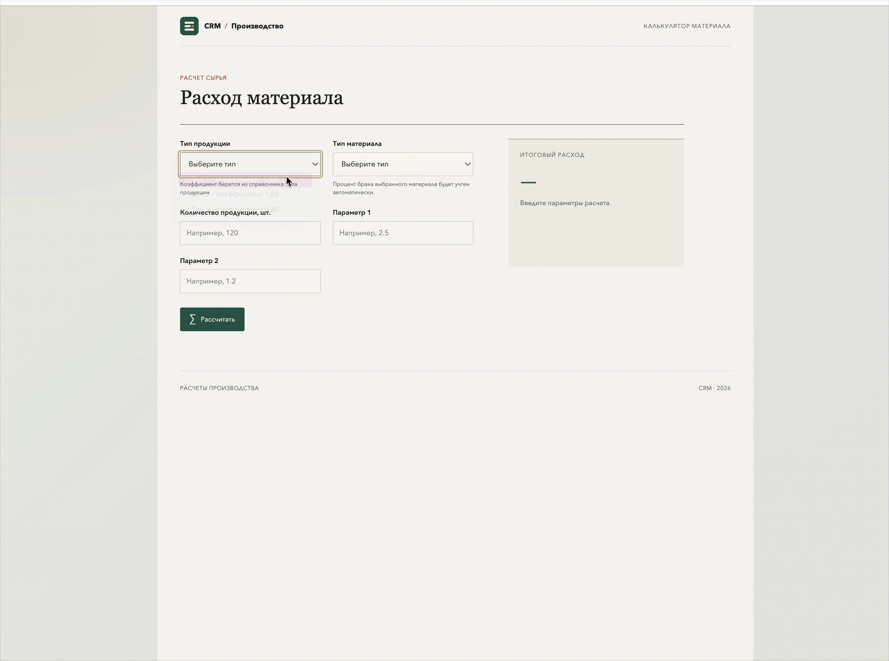

# Интеграция метода расчета и комплексное тестирование

## Реализовано

- Страница калькулятора принимает пять входных параметров и вызывает функцию `calculate_material_requirement` из предыдущего задания через API.
- Справочники типов продукции и материалов загружаются из того же модуля ядра; коэффициент и процент брака видны в списках выбора.
- Успешный расход выводится на экран в целых единицах.
- Результат `-1` показывается как понятная ошибка, приложение не падает.
- API сообщает об отсутствующих параметрах, а сбои запроса отображаются рядом с результатом.

## Запуск

Перейдите в эту папку и выполните:

```bash
python3 server.py
```

Откройте `http://127.0.0.1:8008/`.

Сервер не подключается к БД: он импортирует функцию и демонстрационные справочники из папки задания «Разработка ядра алгоритма расчета материалов».

## Проверка сценариев

Успешный пример:

- тип продукции: `1`;
- тип материала: `2`;
- количество: `100`;
- параметр 1: `1`;
- параметр 2: `1`.

Ожидаемый расход: `126` единиц.

Для проверки обработки ошибки выберите допустимые типы и введите отрицательный параметр. Браузерная проверка остановит отправку с подсказкой. Чтобы проверить именно возврат `-1` из ядра, используйте несуществующий ID через API или unit-тесты задания 2; интерфейс при получении `-1` показывает ошибочное состояние и остается работоспособным.

Запустить интеграционные тесты из этой папки:

```bash
python3 -m unittest discover -s tests -v
```

## Демонстрация


