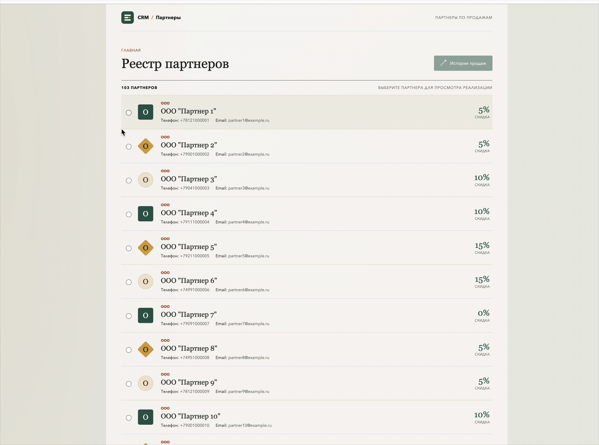

# Разработка интерфейса истории реализации продукции

## Реализовано

- В главном реестре можно выбрать партнера и открыть его историю продаж.
- Идентификатор партнера передается в отдельную страницу истории через `partner_id`.
- `PartnerHistoryWindow` отображает название партнера и таблицу с наименованием продукции, количеством (шт.) и датой продажи в формате ДД.ММ.ГГГГ.
- История загружается из PostgreSQL параметризованным запросом с `JOIN` таблиц `partners`, `shipments`, `shipment_items` и `products`.
- При пустой истории показывается понятное сообщение; при неизвестном партнере API возвращает 404.

## Запуск

Сервер использует CRUD backend из практики 21.09.2026 и его настройки подключения к БД. Убедитесь, что доступны зависимости из backend окружения и настроен `.env` предыдущего этапа. Запустите из этой папки:

```bash
python3 -m pip install -r requirements.txt
python3 server.py
```

Если `python3` по умолчанию не содержит `psycopg2` и `python-dotenv`, используйте интерпретатор из `.venv` интеграционного задания. Откройте `http://127.0.0.1:8007/index.html`.

## Проверка

1. Выберите партнера с продажами, например партнера ID 2, и нажмите «История продаж».
2. Убедитесь, что в заголовке показано название партнера, а строки содержат продукт, количество и дату.
3. Проверьте партнера без истории: должна появиться пустая подсказка без падения приложения.
4. Проверьте неизвестный `partner_id`: страница должна показать сообщение об ошибке, не пустую таблицу.

Параметр `partner_id` можно передать напрямую: `history.html?partner_id=2`.

## Демонстрация


