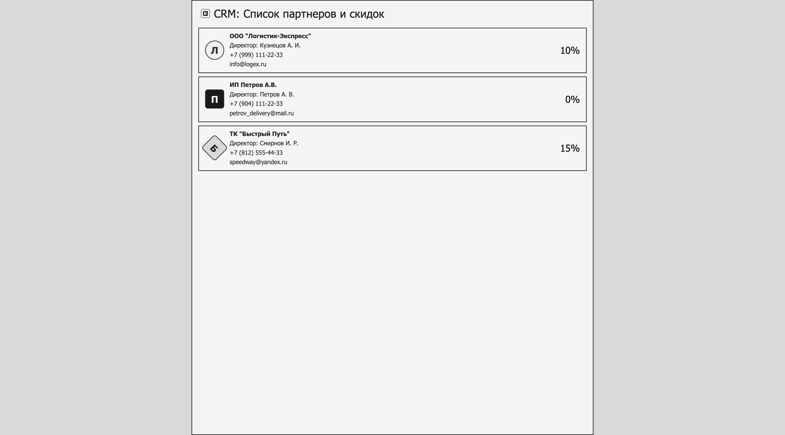

# CRM: Список партнеров и скидок

## Описание

Это простая web-страница, которая демонстрирует визуальный интерфейс списка партнеров для CRM-системы.

В интерфейсе используются:
- заголовок страницы,
- иконка приложения,
- логотип компании,
- карточки партнеров,
- простые геометрические логотипы для каждого партнера,
- единый стиль по руководству по стилю.

## Структура проекта

- `index.html` — основная страница
- `styles.css` — стили интерфейса
- `partners-data.js` — локальная база данных заглушек
- `logo.js` — генерация логотипа по форме и букве
- `render.js` — рендер карточек партнеров
- `assets/` — статические изображения
- `page_sample.png` — пример страницы для визуальной сверки

## Как открыть

Вариант 1 — локальный сервер:

```bash
cd "Учебная практика/учебная практика 14.09.2026/Разработка интерфейса (UI) по руководству по стилю"
python3 -m http.server 8000
```

После этого открой в браузере:

```text
http://localhost:8000/
```

## Пример страницы



## Источник данных

Карточки партнеров формируются из локального массива в `partners-data.js`, который можно заменить на реальные данные из базы PostgreSQL в дальнейшем.
